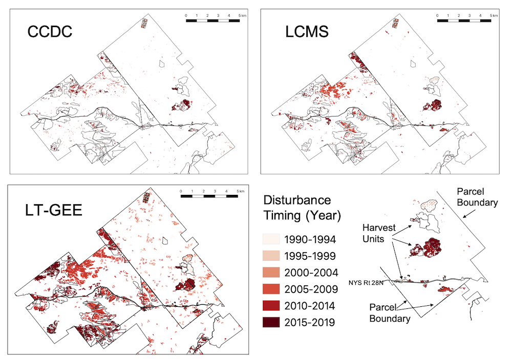
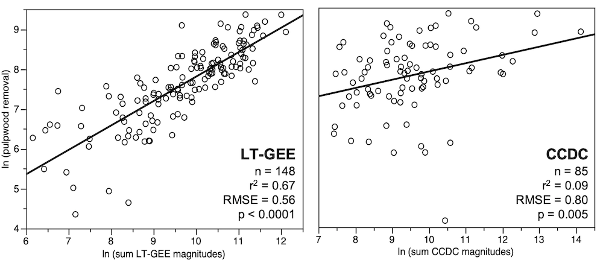

```{r, include=FALSE}
knitr::opts_chunk$set(results = 'asis',
                      echo = FALSE,
                      warning = FALSE,
                      tidy = FALSE,
                      message = FALSE,
                      fig.align = 'center',
                      out.width = "100%")
options(knitr.table.format = "html") 
```

# Introduction

Landscape scale forest monitoring tools are an essential part of the process of growing and sustaining forests as a natural climate solution. Regulatory measures and emissions markets, like forest certification programs, require monitoring and verification to ensure landowner compliance over time. Additionally, forest disturbance regimes in the Northern Forest are expected to shift and intensify due to insect pest outbreaks and extreme weather events. Therefore, there is an urgent need to create efficient and accurate monitoring tools that can provide timely and actionable information on how and where disturbance is taking place, both to understand its effects on forest ecosystem structure, functions, and services (including climate benefits) and to inform stewardship actions in response. 

Change detection algorithms based on satellite imagery can address this need but are largely untested for the forest types, disturbance regimes, and management practices of the US Northeast. Because of the role these types of tools will play in modern forest management, it is essential that these tools be designed with forests, forestry professionals and landowners in mind. 


```{r, include=FALSE}
knitr::write_bib(c('posterdown', 'rmarkdown','pagedown'), 'packages.bib')
```
# Methods
Harvest records from 43,000 hectares of working forests in the Adirondack Park region were compared to outputs from three of the most commonly implemented disturbance detection algorithms - Continuous Change Detection and Classification (CCDC), Landtrendr (LT-GEE), and Landscape Change Monitoring System (LCMS) - using a raster based GIS overlay analysis. The overall accuracy of each algorithm was calculated, as well each algorithms accuracy at detecting common harvest prescriptions. Finally, for the algorithms that provided estimates of disturbance magnitude, those estimates were used to model the pulpwood removals from each harvest.






